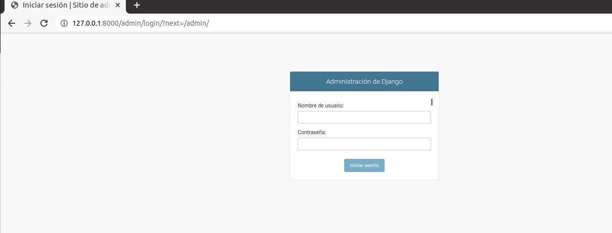
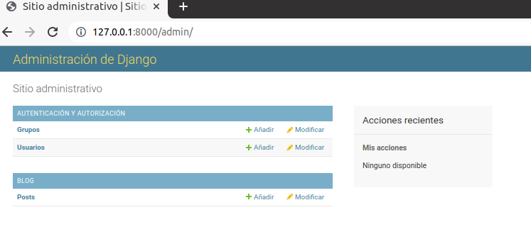
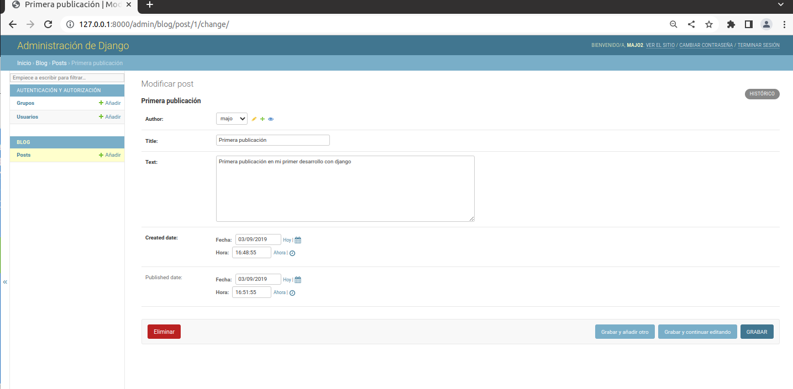
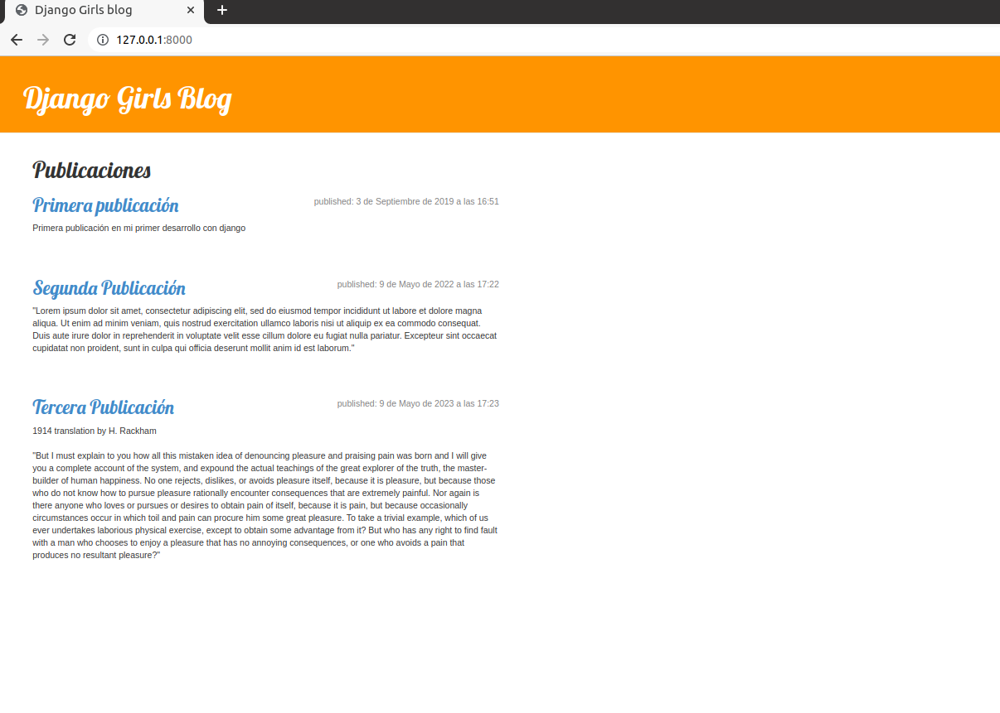
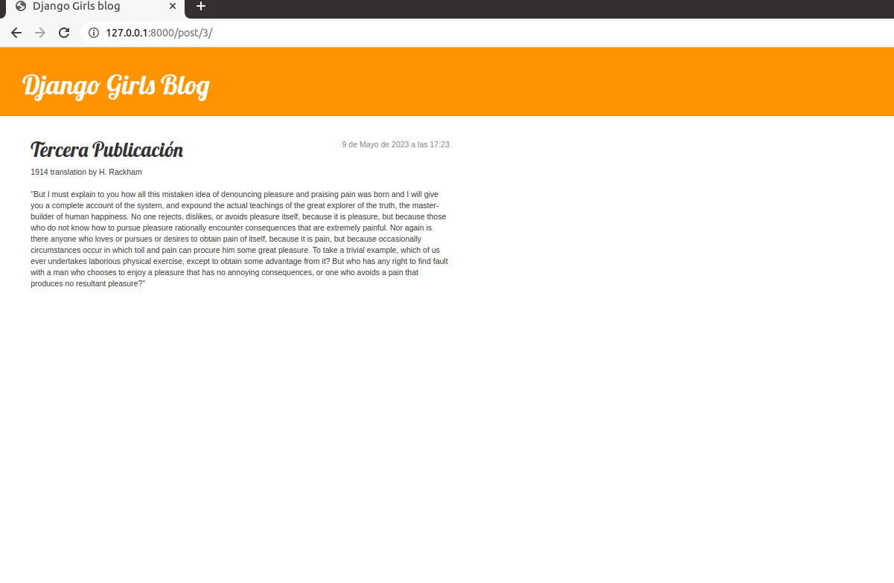

# Blog con Django

Repositorio de un primer desarrollo web con Python y Django resultado del taller Django Girls Pasto

Consiste en un sitio que en su pantalla principal enlista las publicaciones realizadas y además al hacer click sobre el título de una publicación dirige a su página de detalle

Las publicaciones se agregan y editan desde la plataforma de administrador de django.

## Requerimientos

- Python 3.0+
- Django 2.0.6+

## Instrucciones para ejecución local


1. Clonar repositorio con
```
git clone https://github.com/mariameneses/my-first-blog.git
```
2. Ingresar a la carpeta del proyecto
3. Crear y activar ambiente virtual:

```
virtualenv venv
```
```
source venv/bin/activate
```
4. Instalar requerimientos
```
pip install -r requirements.txt
```

5. Crear superusuario
```
python manage.py createsuperuser
```
- Luego, escribe nombre de usuario, dirección de correo electrónico y contraseña

6. Ejecutar proyecto en el equipo local
```
python manage.py runserver
```
7. En un navegador, ingresar a la url `http://127.0.0.1:8000/admin` y digitar la información del usuario creado en el paso 4


8. Agregar publicaciones escogiendo la opción de añadir en el panel izquierdo, en la sección de Blog y Posts.



9. Ahora, dirigirse a la url `http://127.0.0.1:8000` para visualizar las publicaciones en la página de inicio del sitio

- Al hacer click sobre el título de una publicación se dirigirá a su página de detalle


